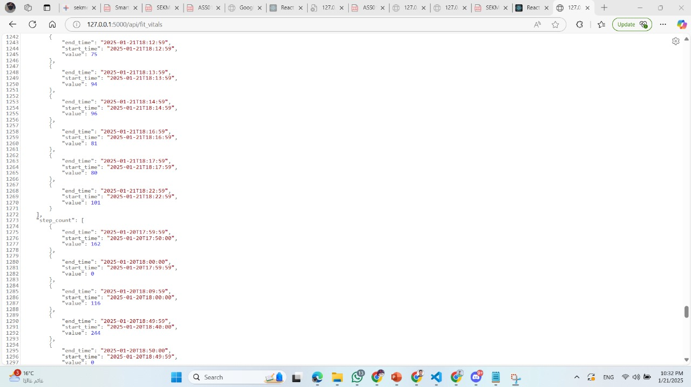
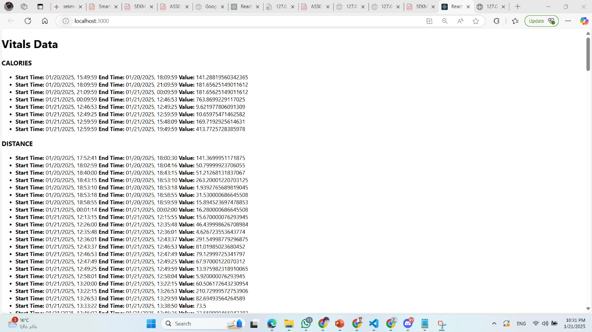

# Google Fit Data Fetcher

## Description
This allows you to fetch health-relate data from Google Fit, the following types of data:

- **Heart Rate (BPM)**
- **Step Count**
- **Calories Expended**
- **Distance Delta**

## 
- **Data Storage in MongoDB**: The data is stored in a MongoDB. `app.py`.
  

- **Frontend with React**: data is displayed in the frontend using React.
  

## Prerequisites
You will need the following two files for the backend:

- `app.py` file: The main backend script that handles the interaction with the Google Fit API and processes the data.
- `client_secrets.json` file: Your OAuth 2.0 credentials from Google Cloud that are used for authentication with the Google Fit API.

After running the backend, open: [http://127.0.0.1:5000/api/fit_vitals](http://127.0.0.1:5000/api/fit_vitals)
